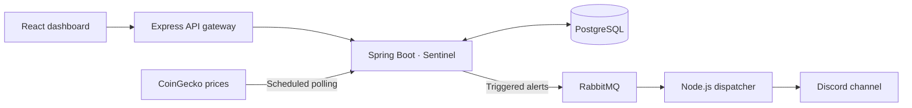

# Kestrel

**Cryptocurrency price alerts, delivered to Discord.**

Kestrel watches the price conditions you care about so you can step away from the charts. Create an alert, connect a Discord channel, and track your rules and recent activity from a single dashboard.

Built with **React, Spring Boot, Express, PostgreSQL, and RabbitMQ**, the project connects a web application to a background monitoring engine and a dedicated notification worker.

## Features

- **Flexible price alerts.** Trigger an alert when an asset rises above a target, drops below it, or moves more than a chosen dollar amount from its saved baseline.
- **Ten supported assets.** Monitor Bitcoin, Ethereum, Solana, Tether, BNB, XRP, Cardano, Dogecoin, Polkadot, and Chainlink using USD prices from CoinGecko.
- **A dashboard for your rules.** View cached prices alongside thresholds, active and paused rule counts, and recent activity. Create, edit, pause, reactivate, or delete alerts.
- **Discord integration.** Save your channel's webhook in Settings and send a test notification before relying on your alerts.
- **Automatic pausing.** Once RabbitMQ accepts a triggered alert, its rule pauses. Reactivate it when you want to watch that condition again.
- **Personal accounts.** Register, sign in, update your profile, change your password, and delete your account. Rules, history, and settings are scoped to their owner.

### Example workflow

1. Connect your Discord webhook and send a test alert.
2. Create a rule such as **“Notify me when Bitcoin drops below $60,000.”**
3. Kestrel checks prices in the background and queues a notification when a sampled price meets the condition.
4. The notification worker posts to Discord; the dashboard records the trigger and shows the rule as paused.

## How it works



| Component | Responsibility |
| --- | --- |
| [Frontend](frontend/) | React, Vite, and Tailwind CSS for the dashboard, alert editor, and account settings |
| [API gateway](api-gateway/) | Express entry point that forwards browser API requests to Sentinel |
| [Sentinel](sentinel/) | Spring Boot service for authentication, rule evaluation, price caching, and PostgreSQL persistence |
| [Alert dispatcher](alert-dispatcher/) | Node.js worker that consumes RabbitMQ messages and delivers Discord notifications |

### Engineering highlights

- **Shared market data.** A single polling cycle supplies prices for all users and rules. Dashboard refreshes read the cache without making extra CoinGecko requests.
- **Asynchronous delivery.** RabbitMQ separates rule evaluation from Discord requests. The worker retries temporary failures and rate limits, then preserves exhausted or permanent failures in a separate queue for inspection.
- **Confirmed publication.** Sentinel waits for the broker to confirm receipt before pausing a rule; a publication failure leaves the rule active for a later cycle.
- **Access controls.** JWT authentication, BCrypt password hashing, server-side ownership checks, webhook destination validation, and encrypted webhook storage are implemented in the backend.
- **Focused regression coverage.** Tests cover authentication and ownership, polling and publication failures, webhook validation, and dispatcher retry behavior. See [verification commands](DEVELOPMENT.md#verification).

## Quick start

With **Docker and Docker Compose** installed and running, from the repository root:

1. Copy [`.env.example`](.env.example) to `.env` if it does not already exist.
2. Replace the secret placeholders and add your CoinGecko Demo API key. Use distinct random secrets: `JWT_SECRET` needs at least 32 bytes; `ENCRYPTION_SECRET` needs exactly 16, 24, or 32 ASCII bytes; use hexadecimal characters for `RABBITMQ_PASSWORD`.
3. Start the complete stack:

   ```sh
   docker compose up -d --build
   ```

Open **http://localhost** once the services finish starting. Register an account, configure your Discord webhook in **Settings**, and create your first alert. Compose includes PostgreSQL and RabbitMQ.

For individual service setup and troubleshooting, see the [development guide](DEVELOPMENT.md). For hosting, see the [deployment guide](DEPLOYMENT.md).

## Current scope

Kestrel is a portfolio project built for a live demo. The backend polls CoinGecko every **15 seconds** by default, and the dashboard refreshes cached prices, rules, and activity every 15 seconds while visible. Price freshness depends on CoinGecko updates. Trigger history records queueing; Discord delivery can still be pending or fail.

The current design runs one Sentinel instance. Queue publication and database updates are separate operations, so a crash can cause duplicate alerts. Remaining work, including session revocation, rate limiting, and delivery reliability improvements, is tracked in [technical debt](TECHNICAL_DEBT.md).
