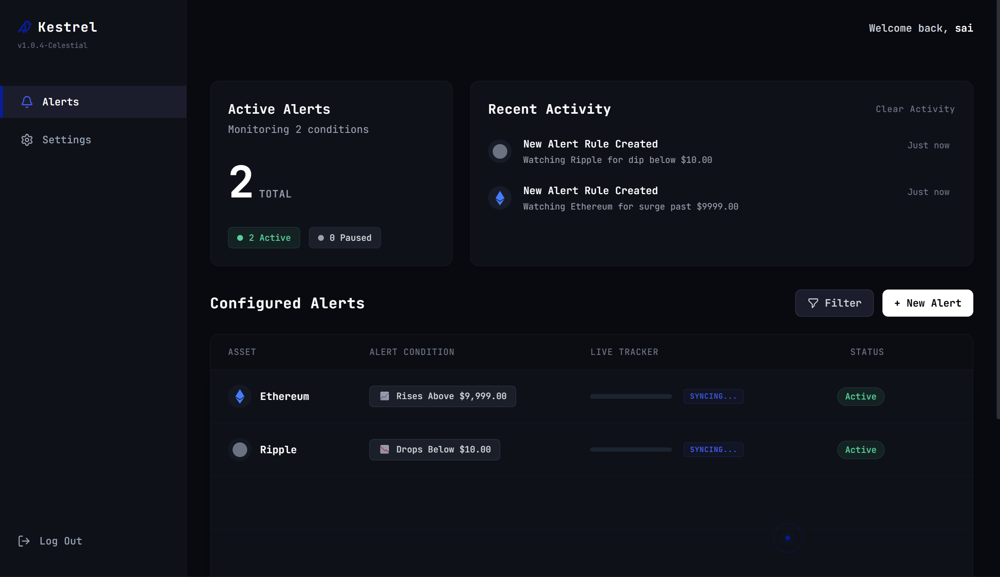
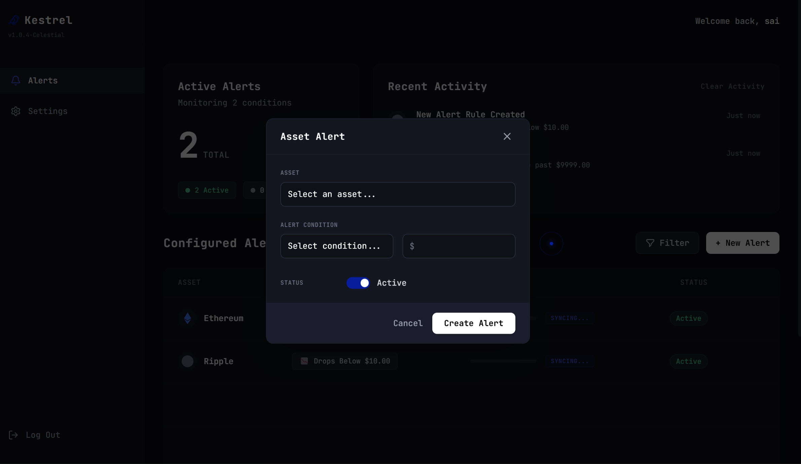
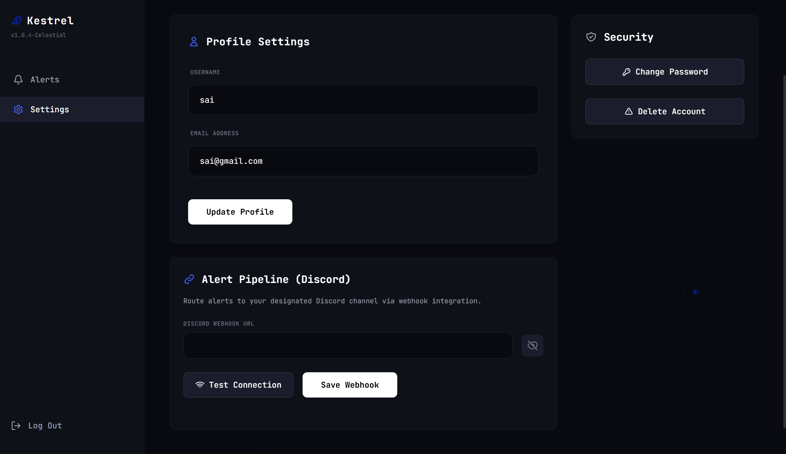
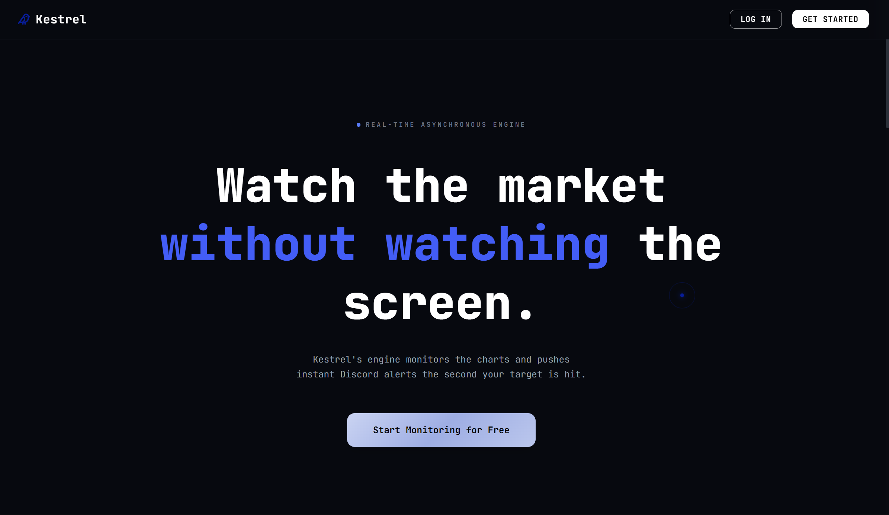
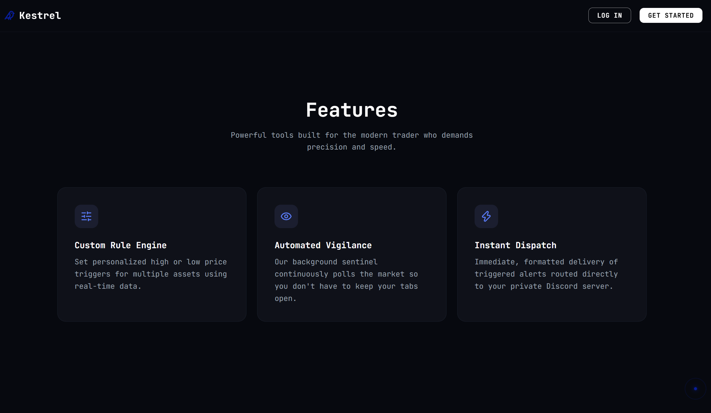
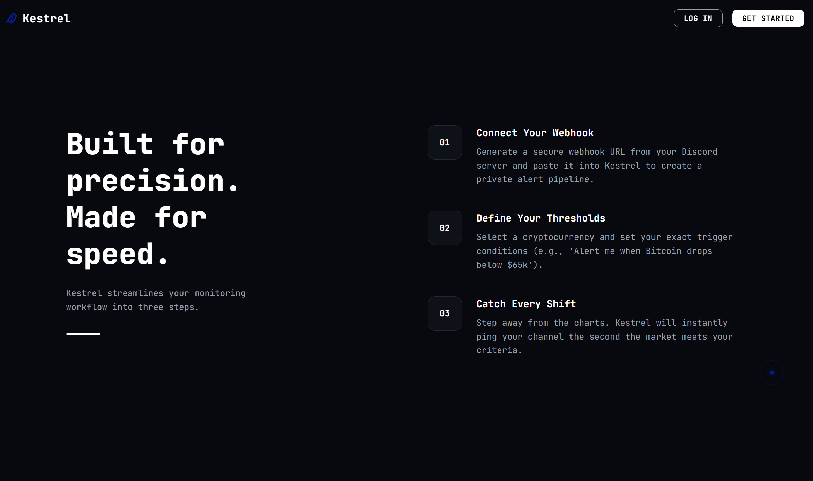
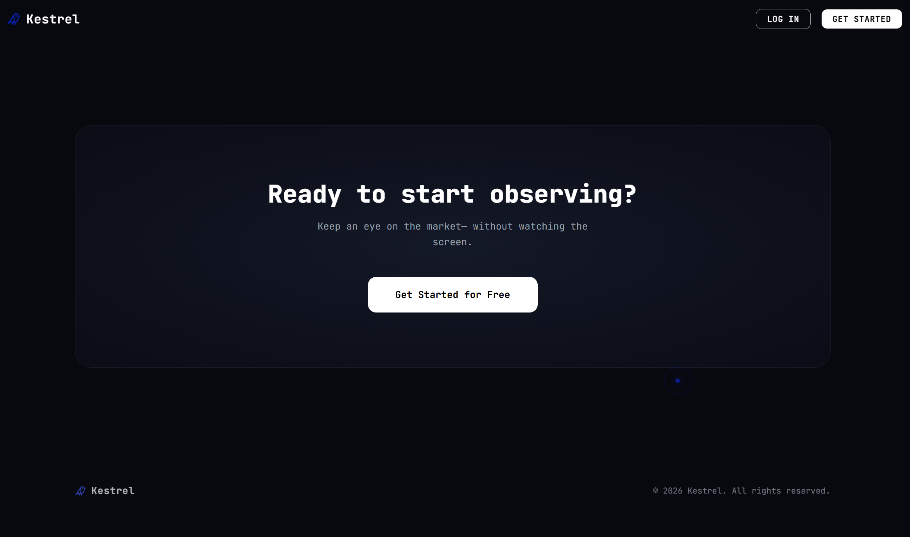
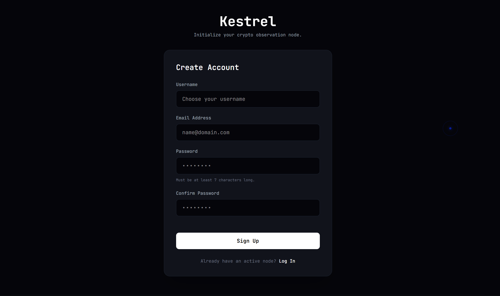
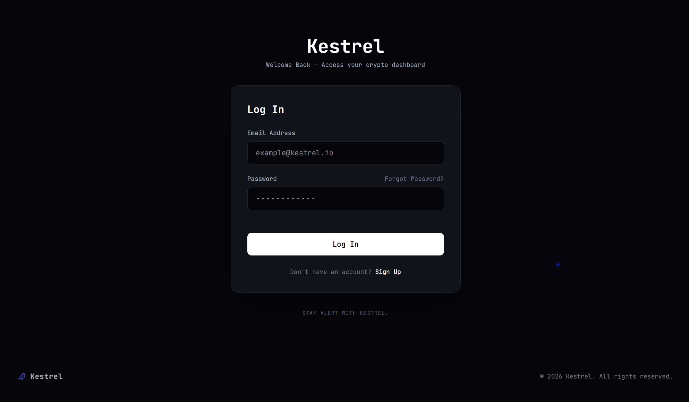
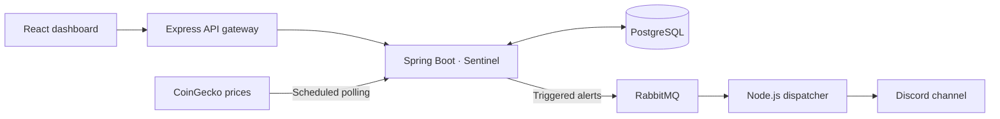

# Kestrel

**Cryptocurrency price alerts, delivered to Discord.**

Kestrel is a full-stack cryptocurrency monitoring application that turns custom price conditions into Discord notifications. Users manage alerts, review activity, and configure their notification channel from a single dashboard.

Built with **React, Spring Boot, Express, PostgreSQL, and RabbitMQ**, the project combines an authenticated web application, scheduled market-data polling, and asynchronous notification delivery.

## Preview

### Alert dashboard

Manage price conditions, track active and paused alerts, and review recent activity.

Alert creation and account settings

### Create an alert

Choose an asset, set a price condition, and control whether the rule is active.

### Settings

Manage profile details, account security, and the Discord webhook connection.

Landing page

### Introduction

### Product features

### Getting started

### Call to action

Sign up and log in

### Sign up

### Log in

## Features

- **Flexible price alerts.** Trigger an alert when an asset rises above a target, drops below it, or moves more than a chosen dollar amount from its saved baseline.
- **Ten supported assets.** Monitor Bitcoin, Ethereum, Solana, Tether, BNB, XRP, Cardano, Dogecoin, Polkadot, and Chainlink using USD prices from CoinGecko.
- **A dashboard for your rules.** View cached prices alongside thresholds, active and paused rule counts, and recent activity. Create, edit, pause, reactivate, or delete alerts.
- **Discord integration.** Save your channel's webhook in Settings and send a test notification before relying on your alerts.
- **Automatic pausing.** Once RabbitMQ accepts a triggered alert, its rule pauses. Reactivate it when you want to watch that condition again.
- **Personal accounts.** Register, sign in, update your profile, change your password, and delete your account. Rules, history, and settings are scoped to their owner.

### Example workflow

1. Connect your Discord webhook and send a test alert.
2. Create a rule such as **“Notify me when Bitcoin drops below $60,000.”**
3. Kestrel checks prices in the background and queues a notification when a sampled price meets the condition.
4. The notification worker posts to Discord; the dashboard records the trigger and shows the rule as paused.

## How it works

## Highlights

- **Shared market data.** A single polling cycle supplies prices for all users and rules. Dashboard refreshes read the cache without making extra CoinGecko requests.
- **Asynchronous delivery.** RabbitMQ separates rule evaluation from Discord requests. The worker retries temporary failures and rate limits, then preserves exhausted or permanent failures in a separate queue for inspection.
- **Confirmed publication.** Sentinel waits for the broker to confirm receipt before pausing a rule; a publication failure leaves the rule active for a later cycle.
- **Access controls.** JWT authentication, BCrypt password hashing, server-side ownership checks, webhook destination validation, and encrypted webhook storage are implemented in the backend.
